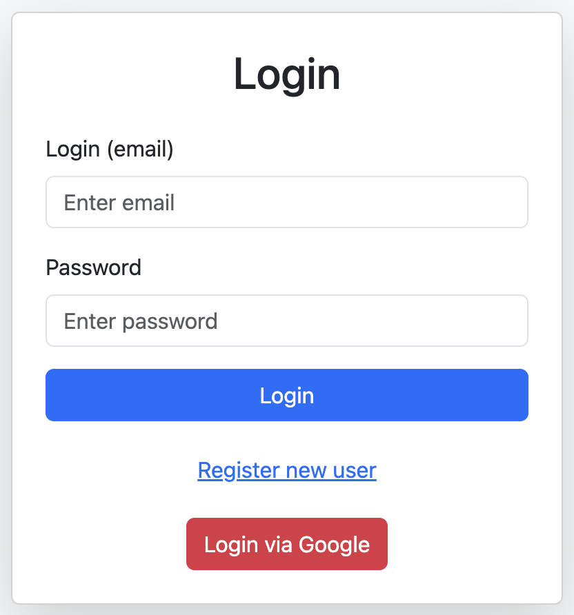

# Internet Banking System


**Java Spring Boot application simulating an Internet Banking System**

## 🚀 About the Project

This project allows you to:

- Open bank accounts
- Make deposits
- Transfer funds between accounts (with automatic currency conversion)
- Manage users (admin functionality)
- Integrate authentication via Google OAuth2
- Send email notifications

The project uses an external API to retrieve exchange rates (EUR/UAH) and 
displays data via a web interface (HTML + Thymeleaf).

---

## 🛠️ Technology Stack

- Java 17
- Spring Boot 3.2
- Spring Security + OAuth2 Client
- Spring Mail
- Thymeleaf + Bootstrap 5
- Maven
- Gmail SMTP
- Fixer API (for exchange rates)

---

## ⚙️ Quick Start

1. Clone the repository:

   ```bash
   git clone https://github.com/IvashDima/JavaPro_FinalProject_InternetBanking.git
   cd JavaPro_FinalProject_InternetBanking
   ```

2. Create a `.env.properties` file in the project root with the following contents:

   ```properties
   spring.mail.username=your_email@gmail.com
   spring.mail.password=your_password
   spring.security.oauth2.client.registration.google.client-id=your_client-id
   spring.security.oauth2.client.registration.google.client-secret=your-client-secret
   ```
3. Set up your Google Cloud Console OAuth2 credentials with Authorized redirect URIs like:

   ```
   http://localhost:8886/login/oauth2/code/google
   ```

4. Run the application:

   ```bash
   mvn spring-boot:run
   ```

5. Open in your browser:

   ```
   http://localhost:8886/
   ```

---
## 📷 Screenshots



---

## 📂 Project Structure

```text
src/main/
├── java/org/example/springbank/
│   ├── config/                 # Application and security configuration
│   ├── controllers/            # Request controllers
│   ├── dto/                    # Data Transfer Objects
│   ├── enums/                  # Enumerations
│   ├── exceptions/             # Exception handling
│   ├── json/                   # JSON-related functionality
│   ├── mail/                   # Email service
│   ├── models/                 # Data models
│   ├── repositories/           # Database repositories
│   ├── retrievers/             # External data retrievers (e.g., currency rates)
│   ├── services/               # Business logic
│   └── Application.java        # Main application entry point
└── resources/
    ├── templates/              # Thymeleaf templates
    └── application.properties  # Application configuration
```

---

## 📌 Important Notes

- This is a student project created as part of a Java Pro course.
- Designed for demonstration purposes for potential employers, recruiters, and teachers.
- Focused on implementing clean architecture, security practices, and basic external API integrations.
- Sensitive credentials should always be protected using environment variables or secret managers.
- Google OAuth2 may require consent screen verification when sensitive data access is involved.
- The application is fully runnable locally without the need for a paid external API.

---

## 📬 Contact

GitHub: [IvashDima](https://github.com/IvashDima)

LinkedIn: [Dmytro Ivashchenko](https://www.linkedin.com/in/dmytro-ivashchenko/)

Email: dnytsyk@gmail.com

Feel free to reach out if you have any questions or suggestions!

---

## 📝 License

This project is provided for educational purposes only and does not have a specific license.

Feel free to contribute, suggest improvements, or fork the project! 🚀

---

## ❓ FAQ

**Q: OAuth2 login isn't working. What should I check?**  
A: Make sure the redirect URI in your Google Cloud Console matches the one in the app exactly.

**Q: Emails are not sent.**  
A: Ensure your Gmail account allows less secure apps or use App Passwords. 
Also, there is a delay of a few minutes before the email is sent. 

**Q: Emails are not received.**
A: Ensure that your transaction is successful (the email is sent only after the transaction is successfully completed). 
Also, check your spam folder.


